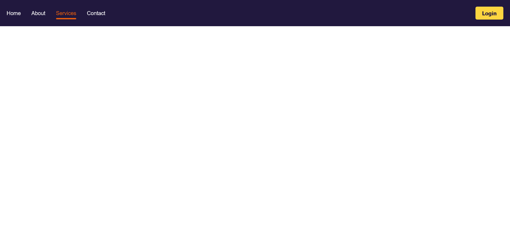

# Make it Pop / ICodeThis Challenge

This is a solution to a challenge "Make it Pop" from the website [ICodeThis](https://icodethis.com/modes/functional/571/submissions/341524).

## Table of contents
- [Task](#task)
- [Screenshot](#screenshot)
- [Links](#links)
- [How it works](#how-it-works)
- [Built with](#built-with)
- [Author](#author)

## Task

In this challenge, you are provided with the HTML and CSS template. Your focus should be on adding the required functionality using JS.
Note: You can't change the HTML and CSS (but you can use JavaScript to alter the DOM if you need)
Implement the following functionalities:
- your task for this challenge is to apply the .active class to the &lt;a&gt; tag that is clicked.
- this will make the selected item pop!
- make sure that there's only one active &lt;a&gt; tag at a time (optional).

## Screenshot

## Links

[Make it Pop Page](https://axinitm.github.io/Make-it-Pop-ICodeThis-Challenge/)

## How it works
This navigation block visually highlights the active menu item. When a user clicks on any link in the site header, it becomes active — changing its color and displaying an underline. At the same time, the active state is automatically removed from all other links. This behavior provides intuitive navigation and a clear indication of the current section.

## Built with

- Semantic HTML5
- Modern CSS3
- Vanilla JS

## Author

- Website - [Andrei Martinenko](https://www.frontender.biz)
- Github - [@AxinitM](https://github.com/AxinitM)
- ICodeThis - [Axinit](https://icodethis.com/Axinit)
